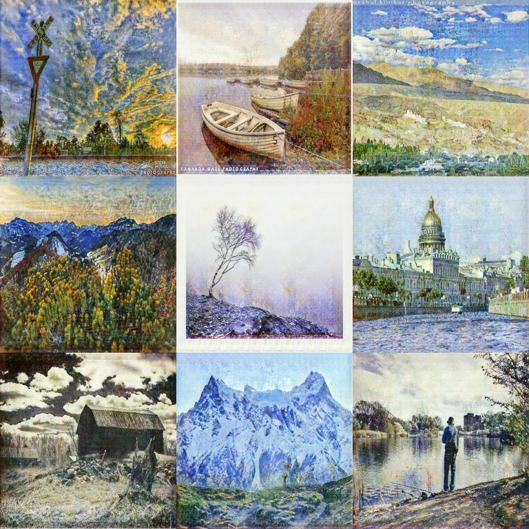

# Kaggle-competition-GANs-Art-Creation
Solution for the Kaggle competition: [I’m Something of a Painter Myself](https://www.kaggle.com/c/gan-getting-started/overview)
The competition consists in generating images in style of Monet, using Generative Adversarial Networks.

This notebook is a CycleGAN implementation with basic data augmentation that could be used as a baseline for the competition.

## Setup

To run locally, the dataset must be downloaded from [here](https://www.kaggle.com/c/gan-getting-started/data) and placed in `dataset/`

If using in a Kaggle notebook, `GCS_PATH` must be changed in block 2.

## Results

This notebook achieves a 45.81 MiFID score.

